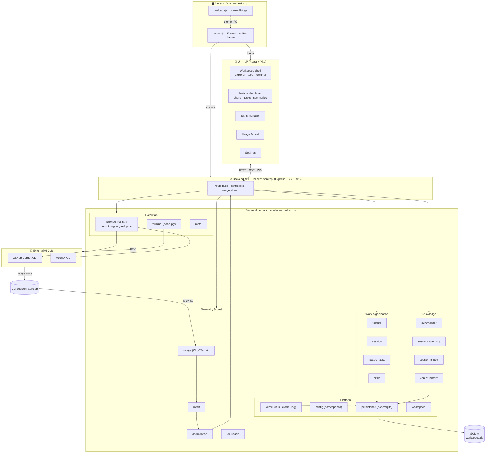

# AI Project Studio

[](https://github.com/sourabh1007/ai-project-studio/actions/workflows/ci.yml)

An **IDE-style desktop app** that turns AI coding CLIs (GitHub Copilot, Agency, …) into a project-centric, observable workspace. AI Project Studio organizes CLI work by **Feature → Session**, runs the interactive CLI in an embedded terminal, and surfaces live **credit (AIC), token, cost, and time** analytics for every run — sourced from the telemetry the CLIs already emit, not a home-grown counter.

It also layers AI-native productivity on top of the raw CLI: reusable **skills** (instruction blocks auto-seeded into sessions), AI-generated **feature task plans**, and automatic **session/feature summaries**.

Built as an npm-workspaces monorepo: a modular **Express** backend (ports & adapters), a **React + Vite** UI, and an **Electron** shell that ties them into a single desktop application.

> New here (human or AI agent)? Start with **[AGENTS.md](AGENTS.md)** and the **[docs/](docs/)** folder.

## Architecture (module-wise)



See **[docs/architecture.md](docs/architecture.md)** for the detailed data flow and **[docs/backend-modules.md](docs/backend-modules.md)** for a per-module reference.

## Features (high level)

- **Feature → Session organization** — group CLI runs under named features; add, rename, and delete inline.
- **Embedded interactive terminal** — run the Copilot/Agency chat TUI in an `xterm.js` terminal that fills the workspace like an editor tab.
- **Live usage & cost analytics** — real-time credit (AIC), token, cost, and time streamed over SSE from the CLIs' own telemetry.
- **Feature dashboard** — AIC-over-time, AIC-by-model, and time-by-session charts plus KPI cards.
- **Skills** — reusable instruction blocks you tag onto features/sessions; automatically seeded into a session's first prompt.
- **AI feature task plans** — generate a structured task breakdown for a feature and track progress.
- **Automatic summaries** — per-session summaries on session end, plus feature-level work summaries.
- **Session import** — pull in past provider-native sessions (Copilot/Agency history) as workspace sessions.
- **Multi-provider by design** — a pluggable provider registry; Copilot and Agency ship today, new CLIs slot in behind one interface.
- **Local-first persistence** — features, sessions, usage, transcripts, and summaries in SQLite (`node:sqlite`).
- **Light & dark themes** with native window chrome.

## Getting Started

### Prerequisites
- **Node.js ≥ 22.5** (the backend uses the built-in `node:sqlite` module)
- **GitHub Copilot CLI** and/or **Agency CLI** installed and on your `PATH`

### Install
```bash
git clone https://github.com/sourabh1007/ai-project-studio.git
cd ai-project-studio
npm install
```

### Run the desktop app
```bash
npm run desktop      # builds backend + UI, launches the Electron shell
```

### Development
```bash
npm run dev          # backend + UI with hot reload (browser)
npm run desktop:dev  # Electron shell pointed at the dev server
```

### Build & test
```bash
npm run build                          # build backend and UI
npm run test:coverage --workspace backend   # backend suite (100% coverage gate)
npm run test:coverage --workspace ui        # UI suite
npm run lint                           # typecheck the backend
```

## Releases

Every push and pull request runs the **CI** workflow (build + backend/UI coverage gates), so broken code can't land on `main`.

To cut a release, push a version tag — the **Release** workflow builds installers for both platforms and attaches them to a GitHub Release:

```bash
git tag v0.3.0
git push origin v0.3.0
```

Produces:
- **Windows** — `.exe` (NSIS installer)
- **macOS** — `.dmg`

> The packaged app spawns the backend with the system Node runtime, so end users need **Node.js ≥ 22.5** installed. Installers are unsigned; on first launch you may need to bypass the OS gatekeeper.

## Project Structure

| Path | Description |
| --- | --- |
| `backend/` | Express API + domain modules (TypeScript, ports & adapters) |
| `ui/` | React + Vite front-end |
| `desktop/` | Electron shell (spawns the backend, loads the UI) |
| `docs/` | Architecture, module reference, and contributor/agent guides |
| `AGENTS.md` | Entry point and working agreement for AI agents & new contributors |

## Documentation

| Doc | What's inside |
| --- | --- |
| [AGENTS.md](AGENTS.md) | How to work in this repo: conventions, invariants, workflow |
| [docs/architecture.md](docs/architecture.md) | Layers, data flow, key patterns |
| [docs/backend-modules.md](docs/backend-modules.md) | Per-module responsibilities & key files |
| [docs/ui-guide.md](docs/ui-guide.md) | UI structure, feature areas, and what's actually mounted |
| [docs/development.md](docs/development.md) | Setup, scripts, testing, debugging, env quirks |
| [docs/adding-a-provider.md](docs/adding-a-provider.md) | Add a new CLI tool behind the provider interface |

## License

Private project.
