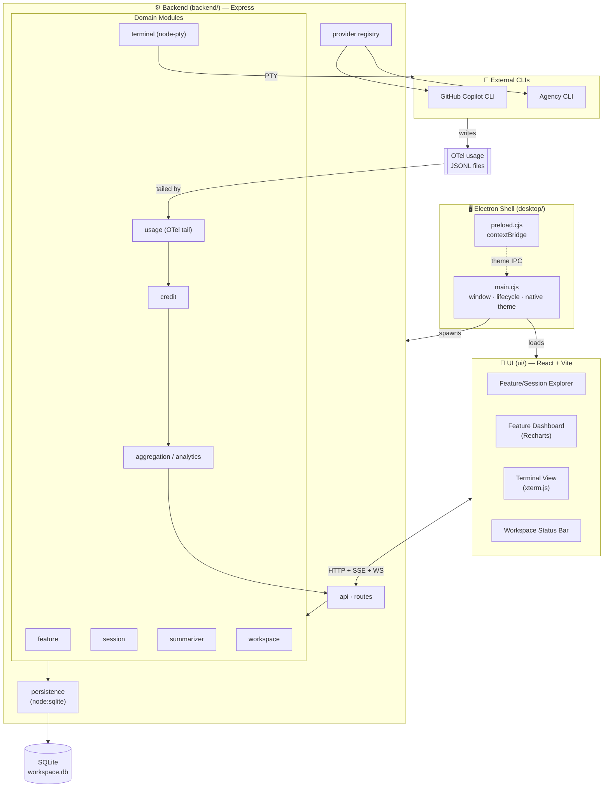

# AI Project Studio

[](https://github.com/sourabh1007/ai-project-studio/actions/workflows/ci.yml)

A project-centric management and observability layer over the GitHub Copilot and Agency CLIs. AI Project Studio is an IDE-style desktop app that organizes CLI work by **Feature → Session** and surfaces live **credit, token, and AIC** analytics for every run — using the usage telemetry the CLIs already emit, not a home-grown counter.

Built as an npm-workspaces monorepo: a modular **Express** backend, a **React + Vite** UI, and an **Electron** shell that ties them together into a single desktop application.

## Architecture



## Getting Started

### Prerequisites
- **Node.js ≥ 22.5** (the backend uses the built-in `node:sqlite` module)
- **GitHub Copilot CLI** and/or **Agency CLI** installed and on your `PATH`

### Install
```bash
git clone https://github.com/sourabh1007/ai-project-studio.git
cd ai-project-studio
npm install
```

### Run the desktop app
```bash
npm run desktop
```
This builds the backend + UI and launches the Electron shell.

### Development
```bash
npm run dev          # backend + UI with hot reload (browser)
npm run desktop:dev  # Electron shell pointed at the dev server
```

### Build & test
```bash
npm run build          # build backend and UI
npm run test:coverage  # backend test suite (100% coverage gate)
npm run lint           # lint the backend
```

## Releases

Every push and pull request runs the **CI** workflow (build + backend/UI tests) so broken code can't land on `main`.

To cut a release, push a version tag — the **Release** workflow builds signed-off installers for both platforms and attaches them to a GitHub Release:

```bash
git tag v0.1.0
git push origin v0.1.0
```

This produces:
- **Windows** — `.exe` (NSIS installer)
- **macOS** — `.dmg`

> The packaged app spawns the backend with the system Node runtime, so end users need **Node.js ≥ 22.5** installed. Installers are unsigned; on first launch you may need to bypass the OS gatekeeper.

## Features

- **Feature → Session organization** — group CLI runs under named features; rename, add, and delete features and sessions inline.
- **Live usage analytics** — real-time credit (AIC), token, and cost tracking streamed over SSE, sourced from the CLIs' own OpenTelemetry output.
- **Graphical feature dashboard** — AIC-over-time, AIC-by-model, and time-by-session charts (Recharts), plus KPI cards for AIC, tokens, sessions, and time spent.
- **Time-spent tracking** — per-session active duration is measured and rolled up per feature.
- **Integrated terminal** — run the interactive Copilot/Agency CLI TUI in an embedded `xterm.js` terminal that fills the workspace like any IDE editor tab.
- **Color-coded features** — each feature gets an accent color reflected in its tabs and swatches.
- **Multi-provider** — pluggable provider registry supporting GitHub Copilot and Agency CLIs.
- **Session reconciliation** — orphaned sessions from a previous run are reconciled on startup so active counts and durations stay honest.
- **Persistent workspace** — features, sessions, usage, and transcripts stored locally in SQLite (`node:sqlite`).
- **Light & dark themes** — modern, professional UI with native window chrome that follows the selected theme.
- **Modular by design** — each backend domain (feature, session, terminal, usage, credit, aggregation, summarizer, workspace) owns its own configuration.

## Project Structure

| Path | Description |
| --- | --- |
| `backend/` | Express API and domain modules (TypeScript) |
| `ui/` | React + Vite front-end |
| `desktop/` | Electron shell (spawns the backend, loads the UI) |

## License

Private project.
