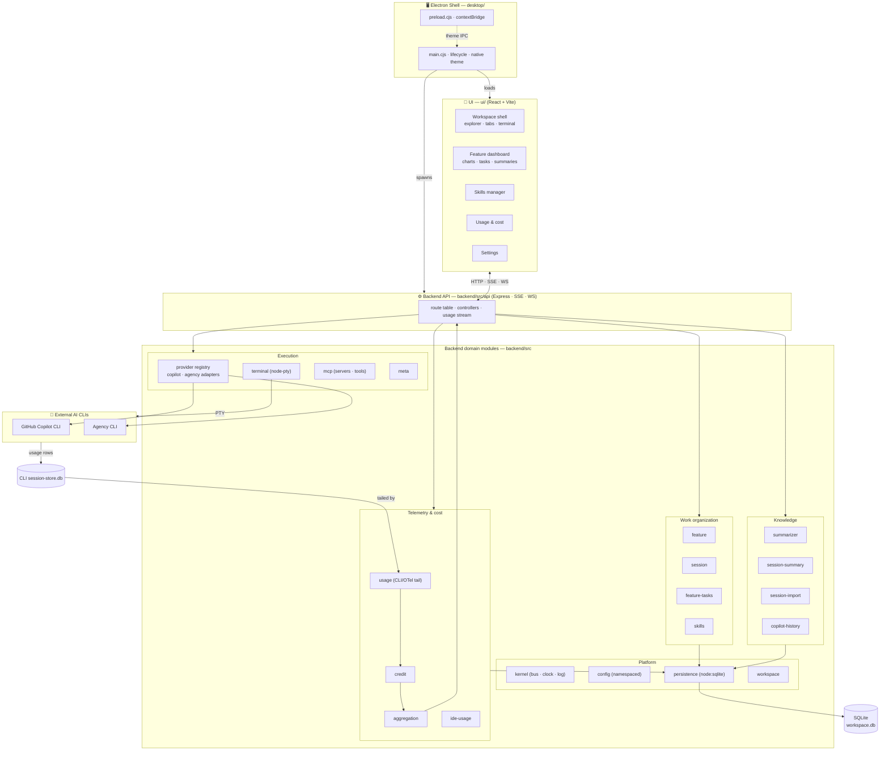

# AI Project Studio

[](https://github.com/sourabh1007/ai-project-studio/actions/workflows/ci.yml)

An **IDE-style desktop app** that turns AI coding CLIs (GitHub Copilot, Agency, …) into a project-centric, observable workspace. AI Project Studio organizes CLI work by **Feature → Session**, runs the interactive CLI in an embedded terminal, and surfaces live **credit (AIC), token, cost, and time** analytics for every run — sourced from the telemetry the CLIs already emit, not a home-grown counter.

It also layers AI-native productivity on top of the raw CLI: reusable **skills** (instruction blocks auto-seeded into sessions), AI-generated **feature task plans**, and automatic **session/feature summaries**.

Built as an npm-workspaces monorepo: a modular **Express** backend (ports & adapters), a **React + Vite** UI, and an **Electron** shell that ties them into a single desktop application.

> New here (human or AI agent)? Start with **[AGENTS.md](AGENTS.md)** and the **[docs/](docs/)** folder.

## Architecture (module-wise)



See **[docs/architecture.md](docs/architecture.md)** for the detailed data flow and **[docs/backend-modules.md](docs/backend-modules.md)** for a per-module reference.

## Features (high level)

Each feature has a focused how-to guide in **[docs/features/](docs/features/README.md)**.

- **[Feature categories](docs/features/feature-categories.md)** — organize every run as **Repository → Feature → Group → Session**; a default **Scratchpad** lets you start instantly.
- **[Sessions](docs/features/sessions.md)** — run the Copilot/Agency chat TUI in an embedded `xterm.js` terminal, with launch-time context bootstrap, auto summaries, and history import.
- **[Skills](docs/features/skills.md)** — reusable instruction blocks tagged onto features/sessions and auto-seeded into a session's first prompt.
- **[PR reviews](docs/features/pr-reviews.md)** — an "Open a PR" flow with a dedicated review page: AI summary, 0–100 scoring, a navigable per-file **change graph** (zoom/pan/scroll/full-screen), inline code diffs, **live PR comments**, and one-click **Approve** (GitHub & Azure DevOps).
- **[MCP servers](docs/features/mcp-servers.md)** — add/edit/**restart** Model Context Protocol servers, discover their tools, and **toggle individual tools** live — applied to open sessions without a shell restart.
- **[Usage & cost](docs/features/usage-and-cost.md)** — live credit (AIC), token, cost & time from the CLIs' own telemetry, feature dashboards, and **IDE AI** metasession attribution that rolls up across the whole hierarchy.

Also: multi-provider by design (pluggable registry — Copilot & Agency today), local-first SQLite persistence (`node:sqlite`), and light/dark themes with native window chrome.

## How it differs from the Copilot app

The GitHub Copilot app/CLI is a single-conversation coding assistant. AI Project Studio wraps that same CLI in a project-centric, observable workspace — it doesn't replace the CLI, it organizes and instruments it. The Copilot app is the *engine*; AI Project Studio is the *cockpit*.

See **[docs/vs-copilot-app.md](docs/vs-copilot-app.md)** for the full side-by-side comparison and guidance on when to use which.

## Getting Started

### Prerequisites
- **Node.js ≥ 22.5** (the backend uses the built-in `node:sqlite` module)
- **GitHub Copilot CLI** and/or **Agency CLI** installed and on your `PATH`

### Install
```bash
git clone https://github.com/sourabh1007/ai-project-studio.git
cd ai-project-studio
npm install
```

### Run the desktop app
```bash
npm run desktop      # builds backend + UI, launches the Electron shell
```

### Development
```bash
npm run dev          # backend + UI with hot reload (browser)
npm run desktop:dev  # Electron shell pointed at the dev server
```

### Build & test
```bash
npm run build                          # build backend and UI
npm run test:coverage --workspace backend   # backend suite (100% coverage gate)
npm run test:coverage --workspace ui        # UI suite
npm run lint                           # typecheck the backend
```

## Releases

Every push and pull request runs the **CI** workflow (build + backend/UI coverage gates), so broken code can't land on `main`.

To cut a release, push a version tag — the **Release** workflow builds installers for both platforms and attaches them to a GitHub Release:

```bash
git tag v0.8.0
git push origin v0.8.0
```

Produces:
- **Windows** — `.exe` (NSIS installer), **code-signed with [Azure Trusted Signing](https://learn.microsoft.com/azure/trusted-signing/)** so it installs without the "Unknown Publisher" SmartScreen warning.
- **macOS** — `.dmg` (currently **unsigned** — no Apple Developer Program membership).

> The packaged app spawns the backend with the system Node runtime, so end users need **Node.js ≥ 22.5** installed.

**Windows signing** activates automatically when the Azure Trusted Signing secrets are configured on the repo (see [docs/development.md → Code signing](docs/development.md#code-signing)); if they're absent the Release workflow still succeeds and just emits an unsigned installer.

**macOS (unsigned) — bypass Gatekeeper on first launch.** Because the `.dmg` isn't signed/notarized, macOS shows *"AI Project Studio can't be opened because Apple cannot check it for malicious software."* To run it:
> - **Right-click** the app in Finder → **Open** → **Open** (only needed the first time), or
> - clear the quarantine flag: `xattr -dr com.apple.quarantine "/Applications/AI Project Studio.app"`.

## Project Structure

| Path | Description |
| --- | --- |
| `backend/` | Express API + domain modules (TypeScript, ports & adapters) |
| `ui/` | React + Vite front-end |
| `desktop/` | Electron shell (spawns the backend, loads the UI) |
| `docs/` | Architecture, module reference, and contributor/agent guides |
| `AGENTS.md` | Entry point and working agreement for AI agents & new contributors |

## Documentation

**Using the app**

| Doc | What's inside |
| --- | --- |
| [docs/features/](docs/features/README.md) | **Feature guides** — task-focused how-tos with in-app navigation. |
| ↳ [Feature categories](docs/features/feature-categories.md) | Repository → Feature → Group → Session, and the default Scratchpad. |
| ↳ [Sessions](docs/features/sessions.md) | Running the AI CLI, summaries, importing history. |
| ↳ [Skills](docs/features/skills.md) | Reusable instructions auto-seeded into prompts. |
| ↳ [PR reviews](docs/features/pr-reviews.md) | Open a PR: review page, change graph, comments, scoring. |
| ↳ [MCP servers](docs/features/mcp-servers.md) | Manage MCP servers and toggle tools live. |
| ↳ [Usage & cost](docs/features/usage-and-cost.md) | Credits, tokens, dashboards, IDE AI. |
| [docs/vs-copilot-app.md](docs/vs-copilot-app.md) | How AI Project Studio differs from the Copilot app. |

**Building & contributing**

| Doc | What's inside |
| --- | --- |
| [AGENTS.md](AGENTS.md) | How to work in this repo: conventions, invariants, workflow |
| [docs/architecture.md](docs/architecture.md) | Application architecture design: layers, data flow, key patterns |
| [docs/backend-modules.md](docs/backend-modules.md) | Per-module responsibilities & key files |
| [docs/ui-guide.md](docs/ui-guide.md) | UI structure, feature areas, and what's actually mounted |
| [docs/development.md](docs/development.md) | Setup, scripts, testing, debugging, env quirks |
| [docs/adding-a-provider.md](docs/adding-a-provider.md) | Add a new CLI tool behind the provider interface |

## License

Private project.
